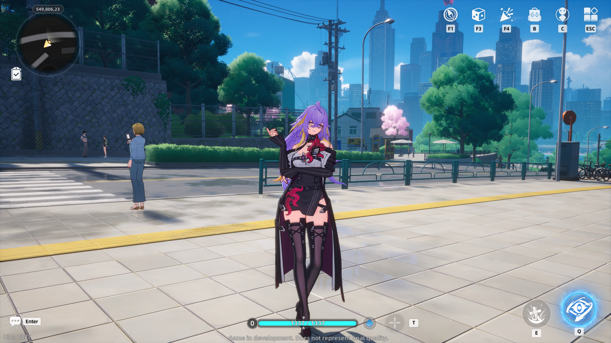

# fadia-rs
##### Experimental server emulator for the game Neverness to Everness

This private fork targets the locally verified **1.3.10 Windows client**.
Companion projects: [nte-dumper](https://github.com/Mar7thDev/nte-dumper) and
[symphonic](https://github.com/Mar7thDev/symphonic).
The loading and connection fixes are documented in
[docs/loading-100-diagnosis.md](docs/loading-100-diagnosis.md).
Original upstream: https://git.xeondev.com/fadia-rs/fadia-rs.



#### NOTE: fadia-rs is currently under active development
## Getting started
### Requirements
- [Rust 1.88+](https://www.rust-lang.org/tools/install)

#### For additional help, you can join our [discord server](https://discord.xeondev.com)

### Setup
#### a) building from sources
```sh
git clone https://github.com/Mar7thDev/fadia-rs.git
cd fadia-rs
cargo run --bin fadia-patchersdk-server
cargo run --bin fadia-gamesdk-server
cargo run --bin fadia-game-server
```
Run each service in a separate terminal from the repository root. Configuration
files are generated locally and are ignored by Git. To build release binaries,
run `cargo build --release --workspace`.

### Logging in
Use the matching `1.3.10` client and the accompanying
[client patch](https://github.com/Mar7thDev/symphonic). The patch enables local
login and routes requests to the local services. Older upstream client builds
use different replication handles and RPC indices.

## Implementation details
- patchersdk-server: implements a basic HTTP file server from which client obtains the "serverlist".
- gamesdk-server: emulates "sdk" server which handles account login and provides the route to the game server.
- game-server: emulates Unreal Engine Dedicated Server, which is used for the entirety of game logic.

## Extra configuration
You can change playable character in the `game_server.toml` file.

## Support
Your support for this project is greatly appreciated! If you'd like to contribute, feel free to submit pull requests.
